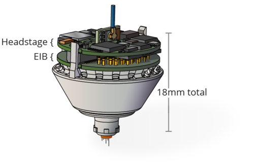

# Shuttle-drive, the next gen. tetrode drive implant 

Tetrode arrays are the gold-standard method for neural recordings in many studies with behaving animals, especially for deep structures and chronic recordings. Here we outline an improved drive design for use in freely behaving animals. Our design makes use of recently developed technologies to reduce the complexity and build time of the drive while maintaining a low weight. The design also presents an improvement over many existing designs in terms of robustness and ease of use. We describe two variants: a 16 tetrode implant weighing ∼2 g for mice, bats, tree shrews and similar animals, and a 64 tetrode implant weighing ∼16 g for rats, and similar animals.These designs were co-developed and optimized alongside a new class of drive-mounted feature-rich amplifier boards with ultra-thin RF tethers, as described in an upcoming paper (Newman, Zhang et al., in prep). This design significantly improves the data yield of chronic electrophysiology experiments.

### Features
- Channel count: 18 drives, up to 64 channels per drive.
- Weight: ~2g for 16 tetrode drives.
- Build time:  < 1 day.
- 4.5 mm travel distance, fully enclosed mechanism, low center of gravity. 

### Components

The drive consists of the following components:
- A 3d printed drive body
- 3d printed drive shuttles
- Polymicro shuttle tubes

These components can be purchased as bundle on our store.
- Polymide tubes to make guide tub arrays have ot be ordered separately.
- Custom screws (reusable) have to be ordered separately.
- Electrode interface boards (EIB) are available for 64ch or 32ch omnetics headstages on our store.

To assemble the drive, an assembly jig, and some other tools are needed.

- Assenbly jig on our store
- Custom screwdriver on our store

### Full parts list / Bill of materials
https://docs.google.com/spreadsheets/d/1LGhZMRnzcyo_r0Nunrh_lfmy5V0NHia-rGRHAYOWq4o/edit?usp=sharing

### Availability
Drive components are available at http://www.open-ephys.org/drive-implant

### Citing the drive: 
When using the Open Ephys shuttle drive implants, please cite the paper:

Jakob Voigts, Jonathan P. Newman, Matthew A. Wilson, Mark T. Harnett (2019). An easy-to-assemble, robust, and lightweight drive implant for chronic tetrode recordings in freely moving animals
https://www.biorxiv.org/content/10.1101/746651v1

